# Map your data with QGIS
There are a lot of mapping tools out there, and more seem to appear every day! And they run the gamut from simple, automated point-mapping services to sophisticated tools for geospatial analysis. Our class already has a [tutorial for mapping with Tableau](http://miriamposner.com/classes/dh201w23/tutorials-guides/mapping/create-a-map-with-tableau/), which lies somewhere in the middle of that spectrum. This tutorial, however, will introduce you to the geospatial software package QGIS, which has sophisticated capabilities for geospatial analysis. We won't really be using those more sophisticated tools in this tutorial; this set of instructions will just familiarize you with the QGIS interface and show you how you can place and style points on a map.

### When does it make sense to use Tableau for mapping and when does it make sense to use QGIS?

Both have their quirks. If you're feeling relatively comfortable with Tableau's interface, you might want to stick with it for mapping. You can build maps fairly easily, you can build sophisticated filters for displaying and styling points, you can create widgets that allow users to interact with your map, and—a major plus—you can publish your map to the web quickly and easily via Tableau Public. I have found, though, that importing basemaps and other data from external sources is pretty wonky (sometimes it works and sometimes it doesn't), I'm not delighted with the mapping documentation for Tableau, and eventually, if you want to do really fancy analysis, you'll hit a limit with Tableau.

With QGIS, everything is a bit more labor-intensive and more customizable. It's free software and has some of the eccentricities that sometimes come with that: a less-than-intuitive interface, some missing functionality (like an easy way to geocode data or publish directly to the web), and documentation that can be a bit spotty. So why learn QGIS? For one thing, a lot of people use it, so it's a good idea to familiarize yourself with it. For another, the ability to use QGIS will provide a great foundation for increasing your knowledge about more advanced forms of geospatial analysis. And with QGIS, you can customize almost everything to your heart's content (assuming you're willing to go to the trouble).

Of course, there are [many other options](http://miriamposner.com/classes/dh201w23/tutorials-guides/mapping/mapping-resources/#:~:text=data.gov.uk-,Other%20mapping%20tools,-Tableau%20is%20good) for creating web-based maps, which you're welcome to explore!

## 1 Download and install QGIS
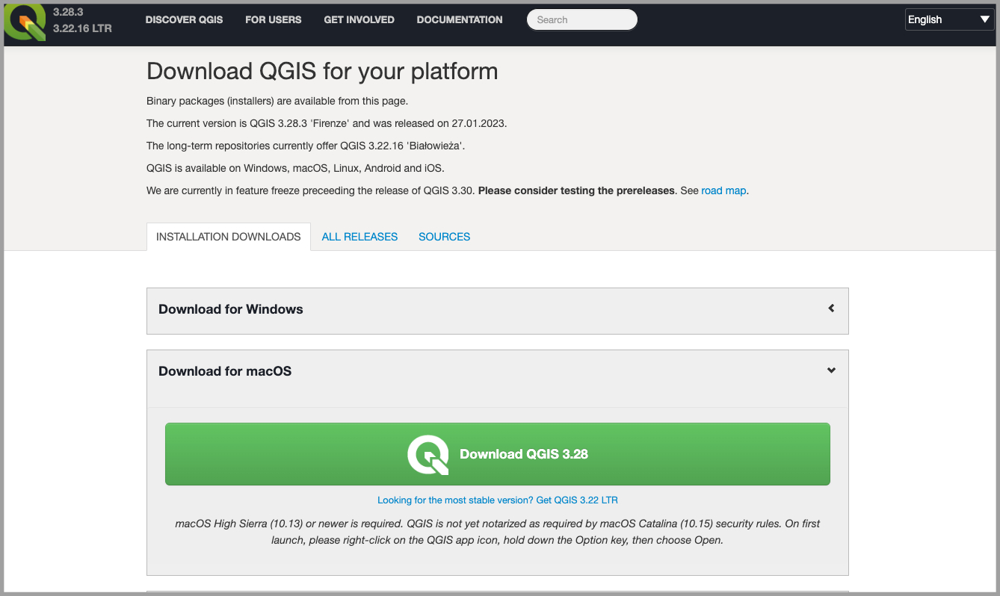

From [QGIS's download page](https://www.qgis.org/en/site/forusers/download.html), download the appropriate version of QGIS and install it as you would any software.

If you're on a Mac, you'll likely get a security warning the first time you try to open QGIS. Try holding down the **Control** key, clicking on the application, and selecting **Open**. If that doesn't work, try some of these steps.

## 2 Open QGIS and start a new project
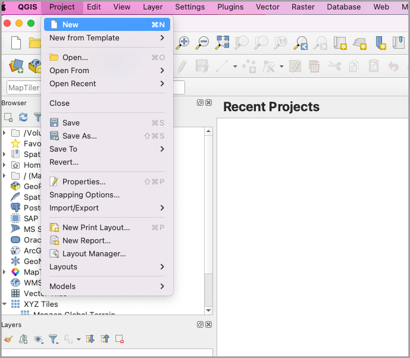

Once you have QGIS open, use the menu to click on **Project**, and then **New.** This creates a new, blank mapping project for you to start with.

(It's a bit intimidating, though, because absolutely nothing shows up in the mapping window!)

## 3 Install some plugins
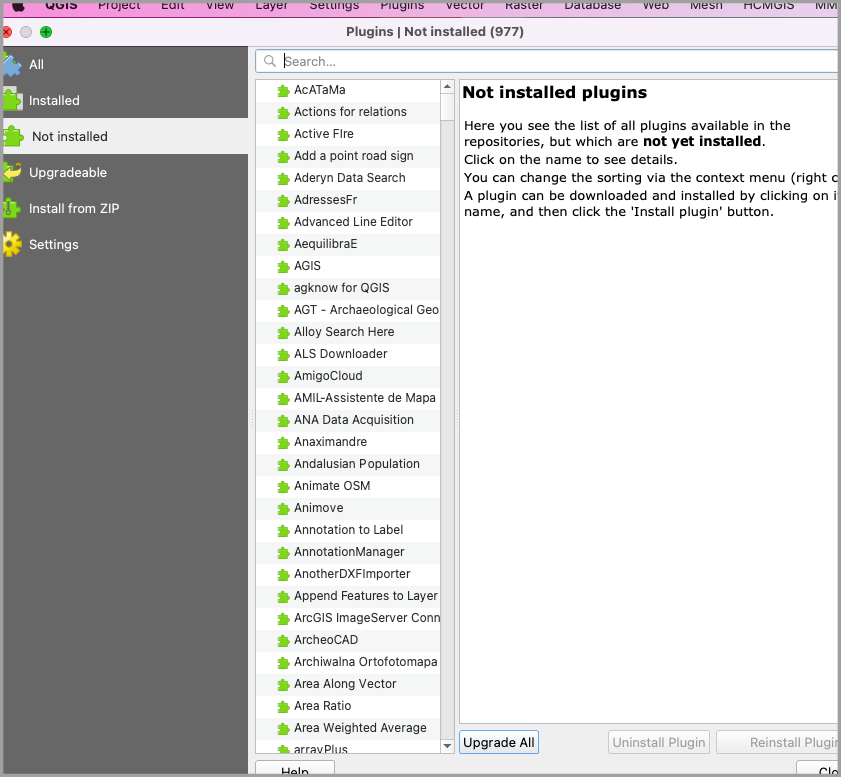

With QGIS (and other kinds of open-source software), plugins are a way for outside developers to add additional functionality to the software. We're going to add a couple of plugins now, which we'll use later on in our project.

From the menu bar, choose **Plugins** and then **Manage and Install Plugins**. From the search bar in the window that appears, look for a plugin called **qgis2web**. Click on **Install** to load it into QGIS.

Now do the same thing for a plugin called **QuickMapServices**.

Now you've installed two additional plugins!

## 4 What kind of data does QGIS want?
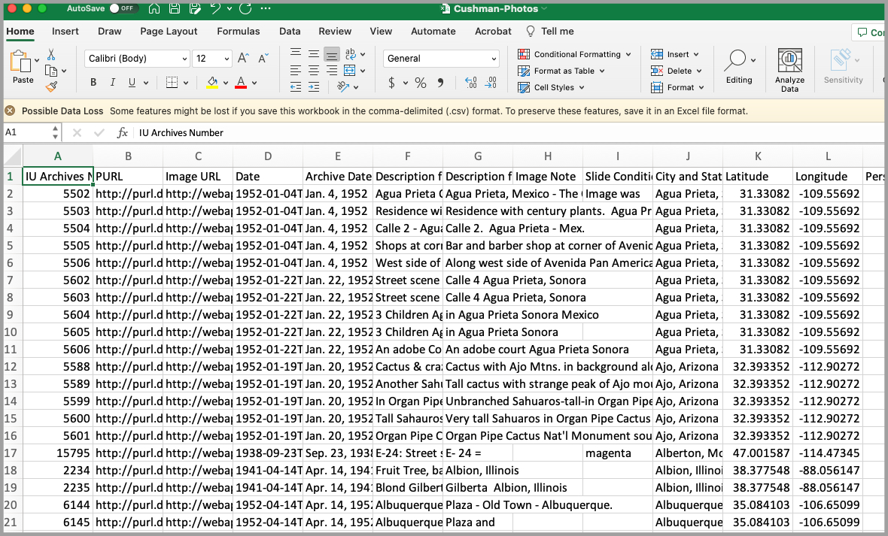

Let's talk a little bit about the kinds of data you can map with QGIS. We'll start with the dataset we're using for this tutorial, which you can [download here](https://www.dropbox.com/s/sqbtme577tes8hq/Cushman-Photos.csv?dl=1).

This dataset contains information about the photographs taken by the amateur photographer Charles W. Cushman. You can read more about it [here](https://libraries.indiana.edu/charles-w-cushman-photograph-collection). I've modified the dataset to restrict to to 1938-1940 and added latitude and longitude coordinates. (More on that soon.)

As this dataset suggests, you can upload a CSV to QGIS. You can see that our data includes both geographical attributes and a lot of other information about each record. QGIS considers this extra information the "attributes" of each piece of data we'll map.

But there's a bit of a catch: If you look closely at our dataset, you'll see that there are columns labeled **Latitude** and **Longitude**. (You can call your geocoordinate columns anything you want; you'll tell QGIS which columns to use in a subequent step.) As you may recall, computers use these coordinates to locate data precisely on a map. The process of moving from human-readable addresses to compter-readable coordinates is called **geocoding**.

**QGIS will not geocode your addresses for you**. (This is in contrast to Tableau and some other programs, like ArcGIS, which *will*.) Well, that's not *entirely* true; there are some QGIS plugins that will help you get coordinates. But setting these plugins up, while not incredibly difficult, requires a number of steps, such as requesting something called an API key, which authorizes you to use a geocoding service. I've concluded that the process of geocoding your data via QGIS (or via another service) is complex enough that including it in this tutorial would make the whole thing way too long. So we're working with data that is already geocoded.

If your own data is not geocoded and you want to use QGIS, you can either

1. use an external service to obtain geocoordinates and add them to your dataset in advance, or you can use one of QGIS's plugins. To obtain geocoordinates online, I've had the best luck with the batch geocoder from [LocalFocus](https://geocode.localfocus.nl/) and the [Google Sheets plugin from Awesome Table](https://workspace.google.com/marketplace/app/geocode_by_awesome_table/904124517349).
2. use a plugin to add geocoordinates within QGIS. To geocode via QGIS, you can [try the plugin MMGIS](https://www.gislounge.com/how-to-geocode-addresses-using-qgis/) (although I ran into some errors when I tried to use it).

(For the future, you may be interested in [other data types](https://docs.qgis.org/3.22/en/docs/user_manual/managing_data_source/supported_data.html) you could use with QGIS, including Shapefiles and GeoPackages.)

## 5 Set a basemap
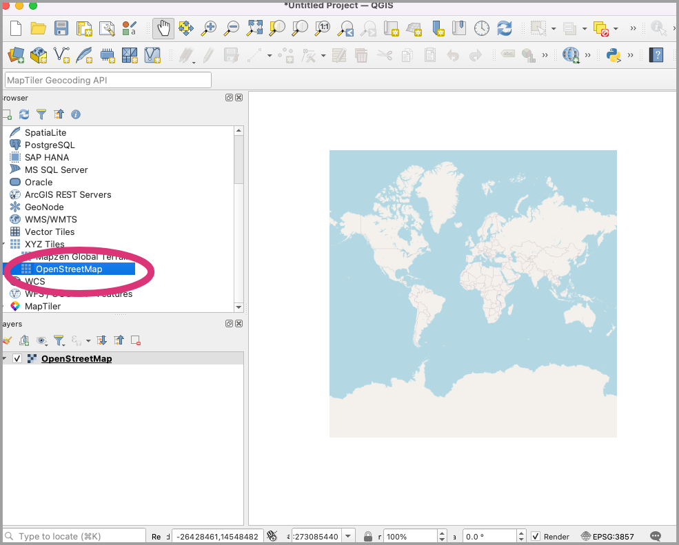

One slightly alarming thing about opening a new project in QGIS is that there's no...map! Just a blank canvas! That's because you need to tell the program what map you want it to start with. You could choose a lot of different options for your basemap, including importing a georeferenced historical map or customizing your own basemap.

(If you would like to learn how to import a historical map to use as a base layer, Fred Gibbs has a [helpful tutorial](http://fredgibbs.net/tutorials/qgis/overlaying-historic-maps-with-qgis.html).)

For now, though, let's keep it simple! From the **Browser** at the left side of your QGIS window, locate the **XYZ Tiles** option and, underneath it, **OpenStreetMap**. Double-click **OpenStreetMap** and a map appears in your main window!

You can manipulate the map by using your mouse or trackpad's scroll function, or by clicking on the hand icon that appears in the QGIS toolbar.

Finally, take a look at the **Layers** panel on the left side of the QGIS window, underneath the **Browser**. You'll notice that a new layer has appeared to correspond with the basemap you just set.

That's how QGIS thinks about the work you do on your maps. As is the case with some other programs, like Photoshop, QGIS adds a new **layer** every time you add a new set of features. You can then work with each layer separately.

## 6 Import your dataset (1)
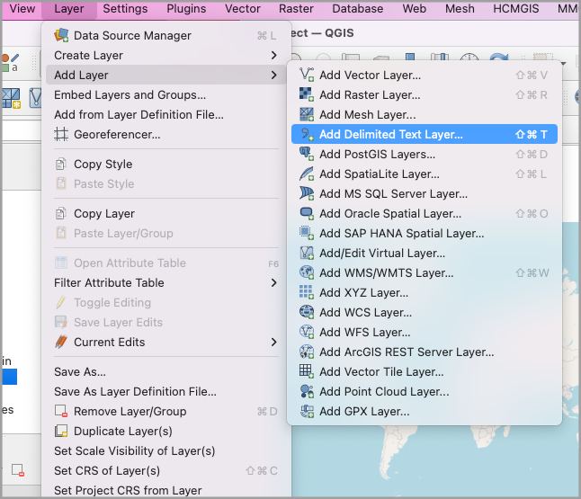

Speaking of layers: let's add a new one by importing the dataset we downloaded in **Step 4**.

From the top menu bar, click on **Layer**, then **Add Layer**, then **Add Delimited Text Layer**. (Why "delimited text layer"? Our CSV is basically a text file that's separated—or delimited—with commas. There are other kinds of delimited text files, too, like tab-separated value files.)

## 7 Import your dataset (2) 
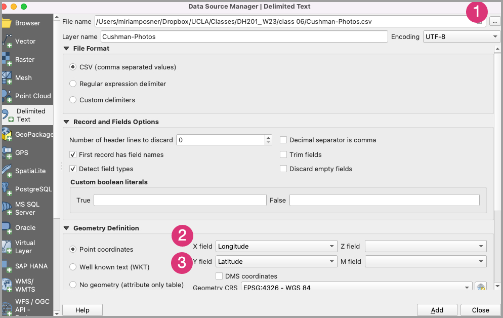

In the Data Source Manager window that appears, use the tiny button to the right of the **File name** box (**1**) to upload the dataset you downloaded in **Step 4**.

In the **Geometry Definition** section, you'll tell QGIS which columns contain your latitude and longitude coordinates. Use the drop-down menu to choose the **Longitude** column for **X field** and **Latitude** column for **Y field**.

Click **Add**. Confusingly, the **Data Manager** window doesn't close after you add your data; you'll have to click **Close**.

## 8 You have a map!
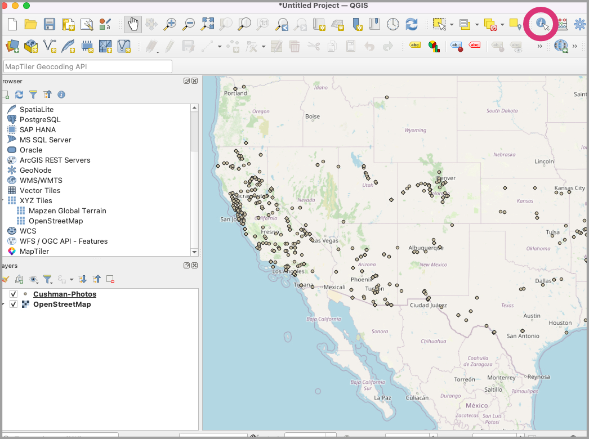

You've now located each of our records on a map! You may need to move the map around in order to see the points.

You can obtain information about each point by clicking on the **Identify Features** button (circled in the step image) and clicking on each point.

## 9 Add tool tips
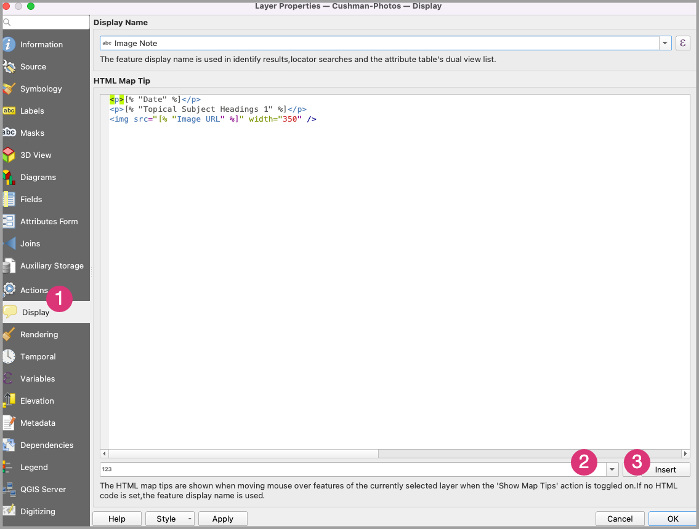

Click the **Pan Map** tool (it looks like a white hand) again so that the **Identify Features** tool is no longer selected.

Let's add tool tips so that we can customize the information we see when we hover over each of the points.

Double-click on the **Cushman-Photos.csv** layer in the **Layers** pane to see the **Layer Properties** window.

Click on the **Display** button on the left side of the **Layer Properties** window (**1**).

The first field in this tab of the window, **Display Name**, customizes which field QGIS uses when you search for results within your data. For now, I'll set it to **Image Note**; it doesn't much matter for our purposes.

In the second field, **HTML Map Tip**, you can combine HTML with special field-specific shortcodes to customize the information that shows up when you hover over a point. For example, if you'd like the tooltip to show the record's city and state, you could choose the **City, State** field.

To insert data from a record's field, choose it from the dropdown menu (**2**) and then click on the **Insert** button (3).

Just for fun, let's combine a shortcode with a tiny bit of HTML so that our tooltips show the images each record refers to. We can do that using the **Image URL** field shortcode, like this:

    
    

When you're done, click **OK**. Now, when you hover over a point on the map with your cursor, you should be able to see an image for each point.

## 10 Customize map symbols
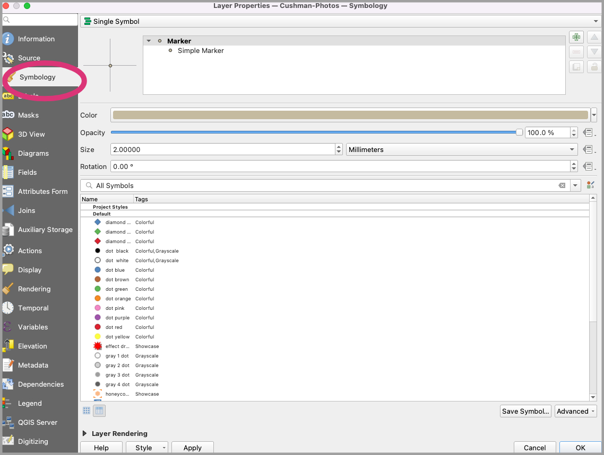

Our current map symbols are pretty blah. Let's make them more interesting.

Double-click on the **Cushman-Photos.csv** item in the **Layers** panel again to reveal the **Layer Properties** window. This time, select the **Symbology** tab.

You'll see that you have a number of options for either customizing your existing map symbol or choosing from a number of preset options. Choose something that's easier to see, then click **OK**.

## 11 Color map symbols based on data
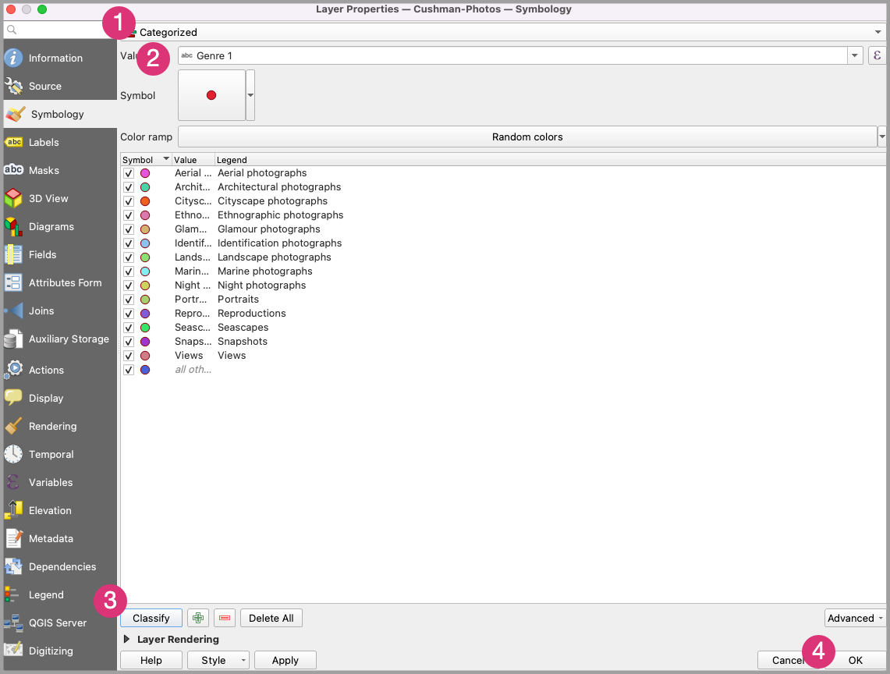

The map symbols definitely look better, but could we find a way to use the points themselves to convey useful information? Let's change the points' color based on values in the data.

Once again, double-click on **Cushman-photos.csv** in the **Layers** panel, and click on **Symbology**.

At the very top of the Symbology tab is a drop-down menu (**1**). Right now it reads **Single****Symbol**, which means that all your marks look the same. Using this dropdown menu, select **Categorized**. This will allow you to customize the look of your points according to categories that appear in your data. (Other options, such as **Graduated** and **Heat Map**, could be better for quantitative data.)

From the **Value** dropdown **(2)**, choose **Genre 1.** (I chose that field because it contains relatively few categories, but feel free to experiment.)

Then click on **Classify (3)**. You'll see a list of categories and their corresponding colors.

Now click **OK (4) **to close the symbology window and see your work.

## 12 You've colored your points!
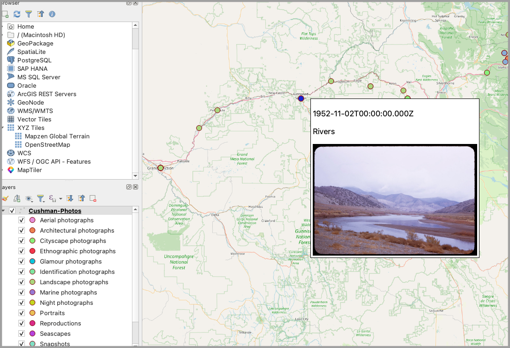

Your points should now be colored by genre. To see a legend, click on the tiny drop-down arrow to the left of the **Cushman-Photos** item in the **Layers** panel.

## 13 Change your basemap
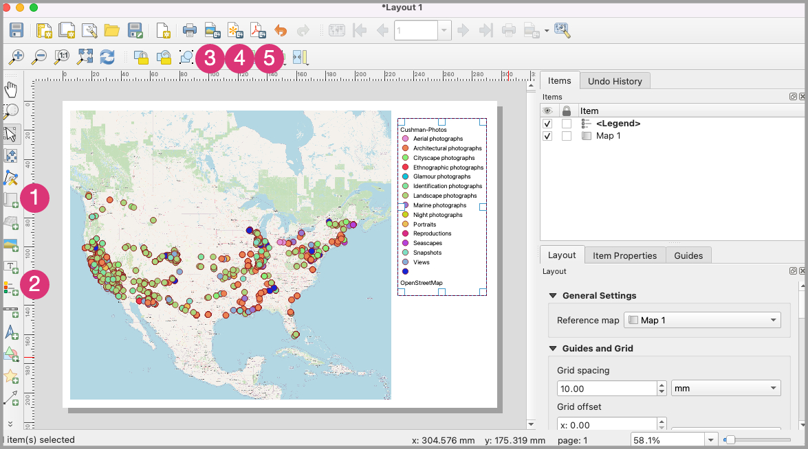

Just to be fancy, let's choose a pretty basemap.

From the **Web** menu, select **QuickMapServices** and then **Search QMS**. In the search bar that appears at the right of your window, search for "Stamen," and then click on **Add** for the **Stamen Watercolor** map. 

In the **Layers** panel at the bottom left, uncheck the **OpenStreetMap** layer. You should now be able to see a fancy watercolor map!

## 14 Layout your map for print
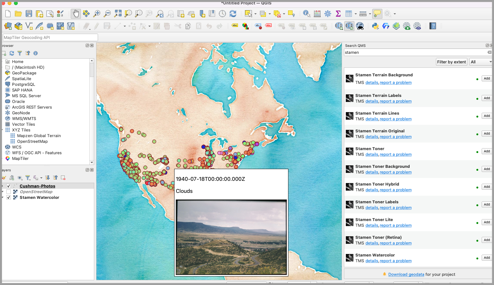

There's much more you could do with your map, but I think that's enough for this tutorial. Let's look at ways you can present your map to the world.

To generate a static PDF or image of your map, zoom to the view of your map you'd like to capture. Then click on **Layout **and then **Print Layout**. Give your layout a name. From the toolbar on the left of the layout window, click on the map **(1)** and legend **(2)** buttons, respectively, to place them on your canvas and resize them.

When you're happy with your static map, you can export it as an image **(3)**, export it as an SVG (**4**; a vector file you can edit in applications like InDesign), or export it as a PDF **(5)**.

## 15 Export your map for the web
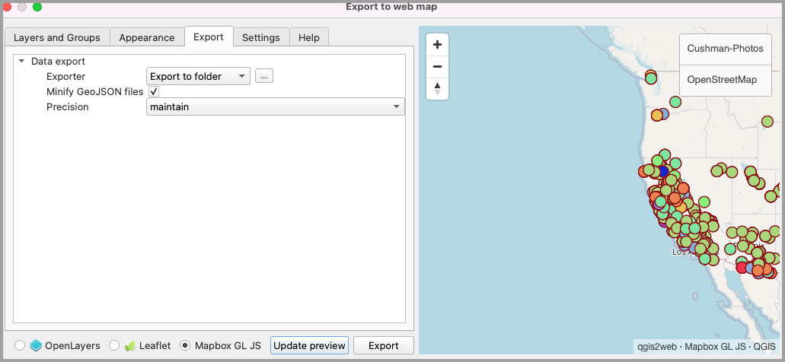

Let's try exporting your map so that you can publish it on the web. You're going to generate a folder that contains various HTML, CSS, and JavaScript files, which you'll have to find hosting for.

We'll use a plugin called qgis2web, which you installed in the third step of this tutorial. The site that qgis2web generates will contain your data and basemap, but you'll lose some of the functionality (such as the customized popups and the Stamen watercolor map) that you added to your QGIS map.

*For an alternative way to publish your map to the web (one which doesn't require you to obtain your own server space), please see *[*these instructions*](https://www.lifeingis.com/publishing-maps-using-qgis-cloud/)* for using the free QGIS Cloud service.*

From the top menu bar, click on **Web** and then **qgis2web. **When the window opens, click on the **Export** tab. Using the **...** button just to the right of the button that reads **Export to folder**, choose where you'd like to save the folder you're about to generate.

## 16 Customize your web map
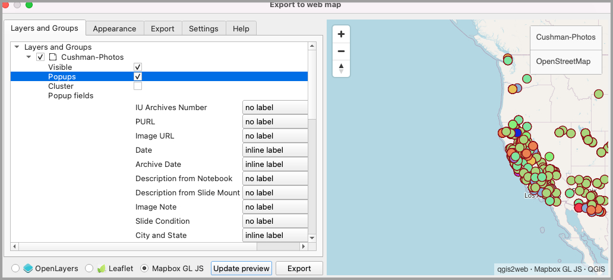

Now click on the **Layers and Groups** tab. Choose whether you'd like to see popups when users click on your map, and if so, which fields to include.

*For more detailed information on the various options included with the QGIS plugin, see *[*this page*](about:blank)*.*

When you're ready to publish, at the bottom of the window, select **Mapbox GL JS** and press the **Update preview** button. If you're happy with what you see, click on **Export**.

## 17 View your web map
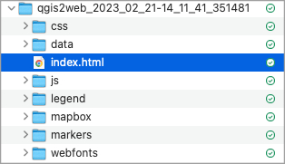

Find the folder you just generated and open it. Locate the file called **index.html** and double-click on it. It should open in a browser window.

Note that you can modify all of the files you've generated in order to customize your site.

## 18 Host your web map
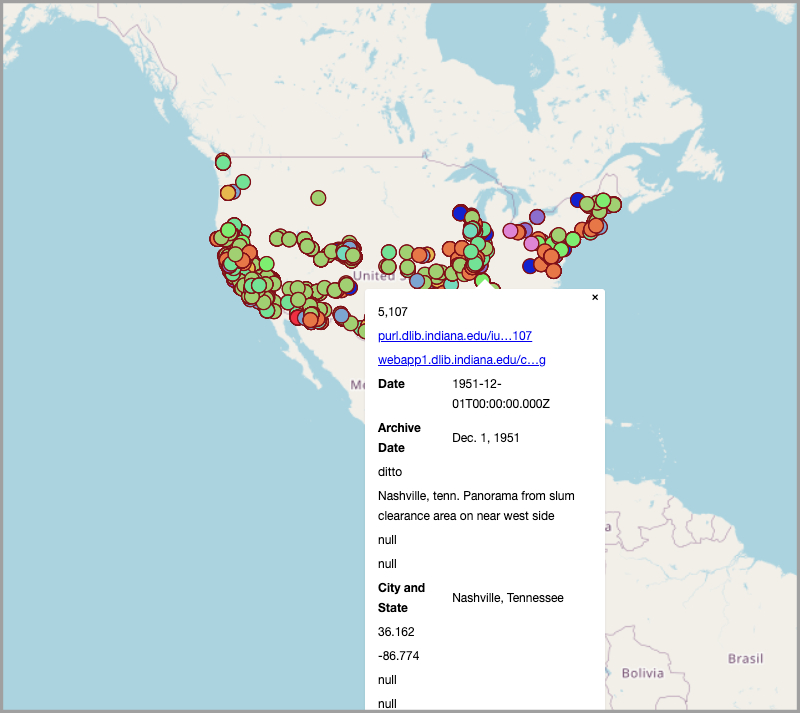

For information on how to upload your exported map to a server, please see [these instructions](https://www.gispo.fi/en/blog/why-you-should-use-qgis2web-plugin-github-pages-to-produce-interactive-maps/). For information on how to embed your web map in another website, see [here](https://github.com/taylorhixson/WF#integrating-with-a-website).

This tutorial has introduced you to the very basics, which I hope will make it easier for you to build on your knowledge as you explore QGIS's more advanced functions. Here are some cool things you can do with QGIS:

- [Measure the distance between two points.](https://buas.libguides.com/c.php?g=661924&amp;p=4677047)
- [Create a heat map](https://www.qgistutorials.com/en/docs/3/creating_heatmaps.html).
- [Draw polygons.](https://docs.qgis.org/2.14/en/docs/training_manual/create_vector_data/create_new_vector.html)
- [Use attributes to select features.](http://www.davidmckie.com/CH7%20-%20Selecting%20Featuresin%20QGIS%20Desktop.pdf)

To learn more about QGIS in a more structured way, you might be insterested in the book [*Learn QGIS*](https://learning.oreilly.com/library/view/learn-qgis/9781788997423/)(you're able to access this for free with your UCLA account) or the LinkedIn Learning class [Learning QGIS](https://www.linkedin.com/learning/learning-qgis-2/exploring-the-powerful-world-of-qgis?u=76279468) (you can access LinkedIn Learning classes for free [with your LAPL card](https://www.lapl.org/linkedin-learning)).
